# Transport-Layer-Security
Transport Layer Security

|  Name   | Title |
| ------------- | ------------- |
| Muhammad Sohail | Transport Layer Security  |

Instruction: https://seedsecuritylabs.org/Labs_20.04/Files/Crypto_TLS/Crypto_TLS.pdf
# Lab Environment
Set up 3 containers:
```
client: 10.9.0.5
server: 10.9.0.43
proxy: 10.9.0.143
```
```
curl https://seedsecuritylabs.org/Labs_20.04/Files/Crypto_TLS/Labsetup.zip -o Labsetup.zip
unzip Labsetup.zip
cd Labsetup
dcbuild
dcup -d
```
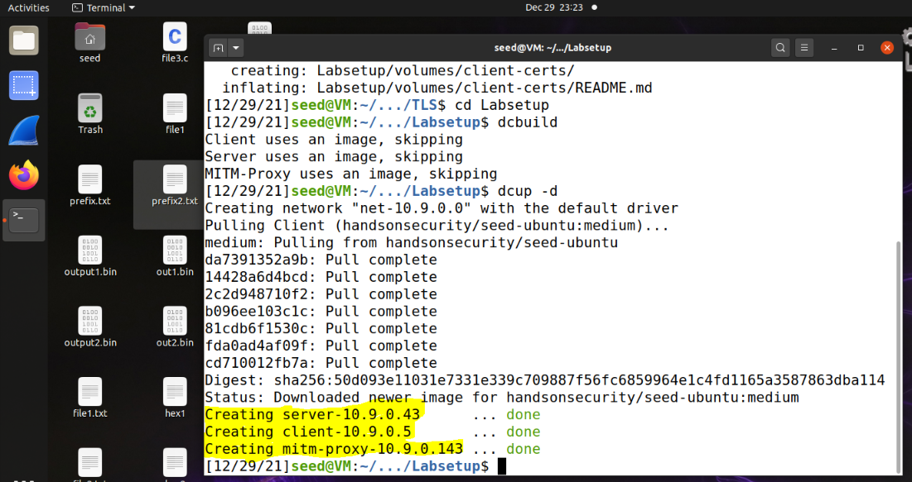

# Task 1
### Task 1.a
We try to create a TCP connection between our VM (not container) with ```https://github.com/```
```
cd volumes
./handshake.py github.com
```
- What is the cipher used between the client and the server?

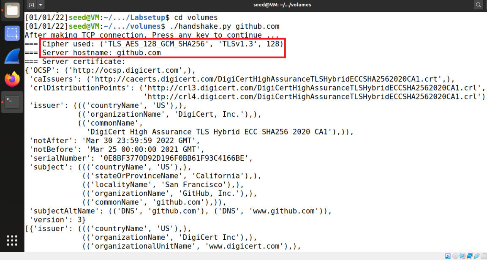

```handshake.py github.com``` gives:
```
After making TCP connection. Press any key to continue ...
=== Cipher used: ('TLS_AES_128_GCM_SHA256', 'TLSv1.3', 128)
=== Server hostname: github.com
=== Server certificate:
{'OCSP': ('http://ocsp.digicert.com',),
 'caIssuers': ('http://cacerts.digicert.com/DigiCertHighAssuranceTLSHybridECCSHA2562020CA1.crt',),
 'crlDistributionPoints': ('http://crl3.digicert.com/DigiCertHighAssuranceTLSHybridECCSHA2562020CA1.crl',
                           'http://crl4.digicert.com/DigiCertHighAssuranceTLSHybridECCSHA2562020CA1.crl'),
 'issuer': ((('countryName', 'US'),),
            (('organizationName', 'DigiCert, Inc.'),),
            (('commonName',
              'DigiCert High Assurance TLS Hybrid ECC SHA256 2020 CA1'),)),
 'notAfter': 'Mar 30 23:59:59 2022 GMT',
 'notBefore': 'Mar 25 00:00:00 2021 GMT',
 'serialNumber': '0E8BF3770D92D196F0BB61F93C4166BE',
 'subject': ((('countryName', 'US'),),
             (('stateOrProvinceName', 'California'),),
             (('localityName', 'San Francisco'),),
             (('organizationName', 'GitHub, Inc.'),),
             (('commonName', 'github.com'),)),
 'subjectAltName': (('DNS', 'github.com'), ('DNS', 'www.github.com')),
 'version': 3}
[{'issuer': ((('countryName', 'US'),),
             (('organizationName', 'DigiCert Inc'),),
             (('organizationalUnitName', 'www.digicert.com'),),
             (('commonName', 'DigiCert High Assurance EV Root CA'),)),
  'notAfter': 'Nov 10 00:00:00 2031 GMT',
  'notBefore': 'Nov 10 00:00:00 2006 GMT',
  'serialNumber': '02AC5C266A0B409B8F0B79F2AE462577',
  'subject': ((('countryName', 'US'),),
              (('organizationName', 'DigiCert Inc'),),
              (('organizationalUnitName', 'www.digicert.com'),),
              (('commonName', 'DigiCert High Assurance EV Root CA'),)),
  'version': 3}]
After TLS handshake. Press any key to continue ...
```
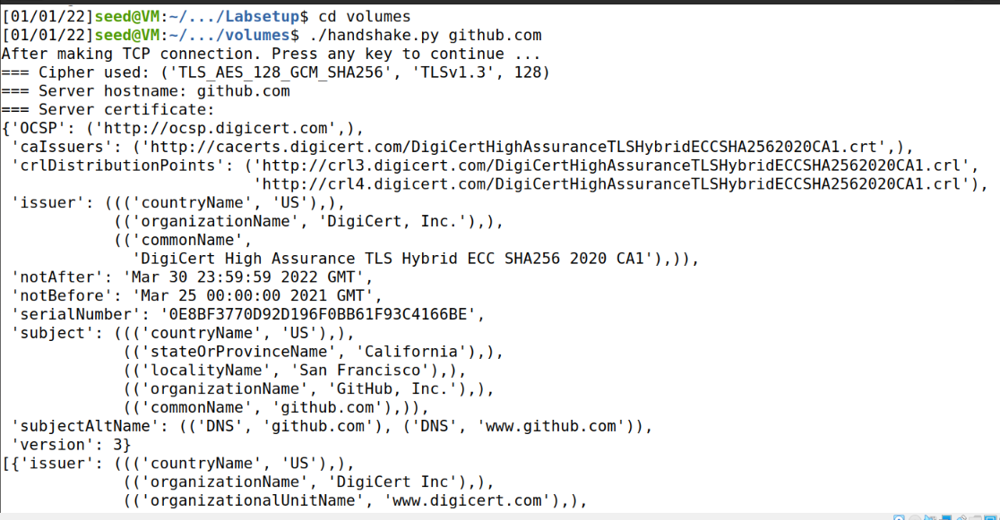
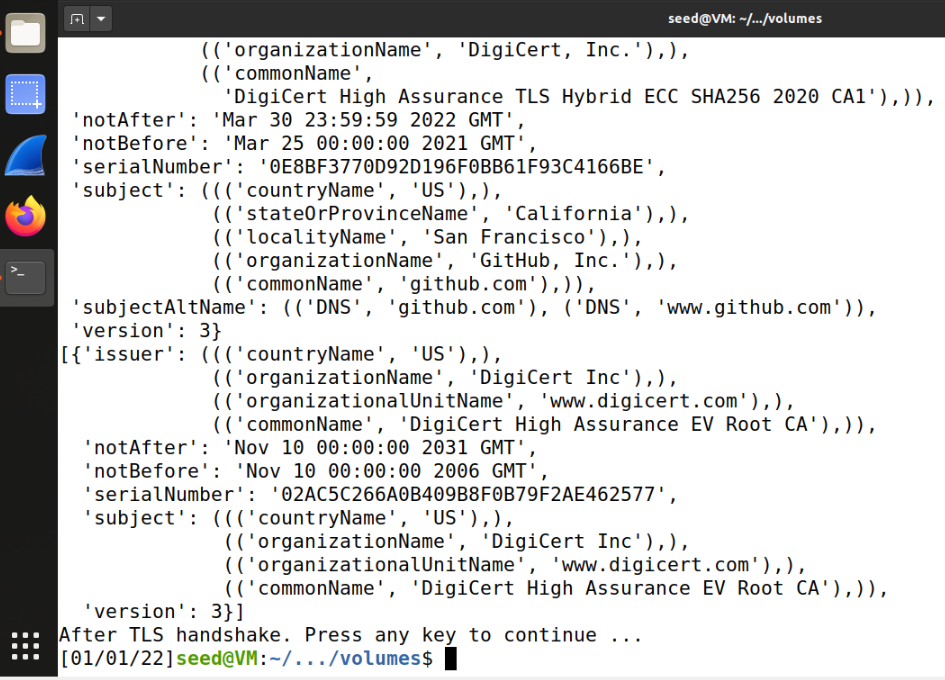
Reference to the SSL module documentation, ```/etc/ssl/certs/``` specifies the location of CA certificates that are used to validate the servers' certificates.
It may be hard to keep tracing of packets in TLS handshake when running VNC server. So we can run the script in one container via ```dockerps``` and focus on the corresponding network interface:
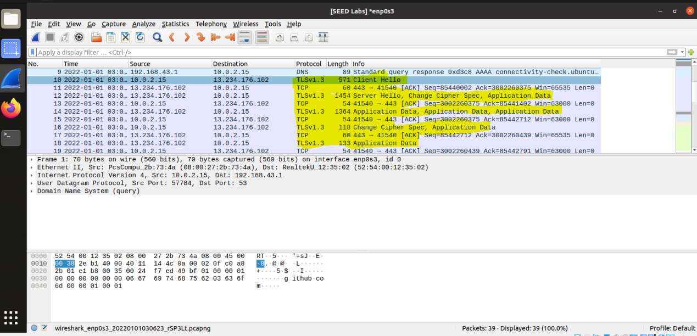
### Task 1.b
First change the ```cadir = ’/etc/ssl/certs’``` To ```cadir = ’./client-certs’```
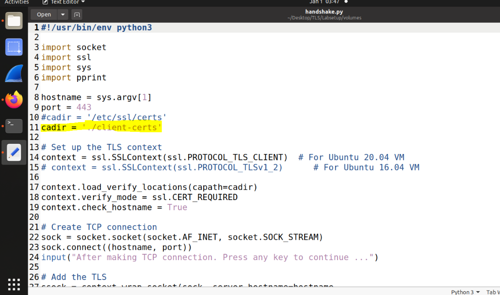
Than reun the code above
After creating the TCP connection, it fails to verify server's certificate:
```
After making TCP connection. Press any key to continue ...
Traceback (most recent call last):
  File "./handshake.py", line 29, in <module>
    ssock.do_handshake()   # Start the handshake
  File "/usr/lib/python3.8/ssl.py", line 1309, in do_handshake
    self._sslobj.do_handshake()
ssl.SSLCertVerificationError: [SSL: CERTIFICATE_VERIFY_FAILED] certificate verify failed: unable to get local issuer certificate (_ssl.c:1131)
```
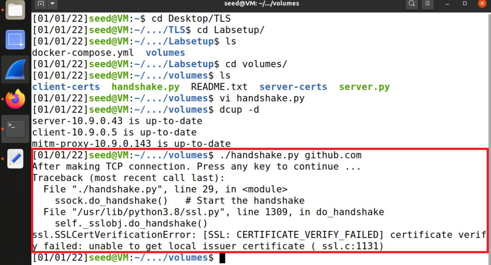
To solve this problem, you need to place the corresponding CA’s certificate into your certs folder.
Please use your client program to find out what CA certificate is needed to verify the ```github.com```
server’s certificate, and then copy the certificate from the ```/etc/ssl/certs``` to your own folder.
```
sudo cp /etc/ssl/certs/DigiCert_High_Assurance_EV_Root_CA.pem /home/seed/Desktop/TLS/Labsetup/volumes/client-certs/
```
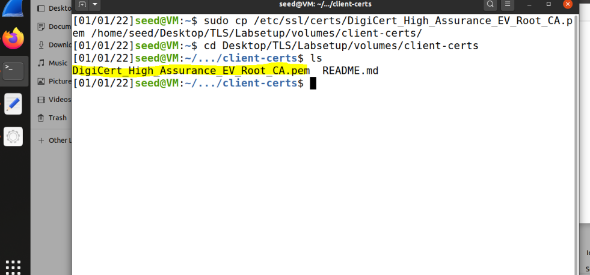
Now we run the command again to see the result.
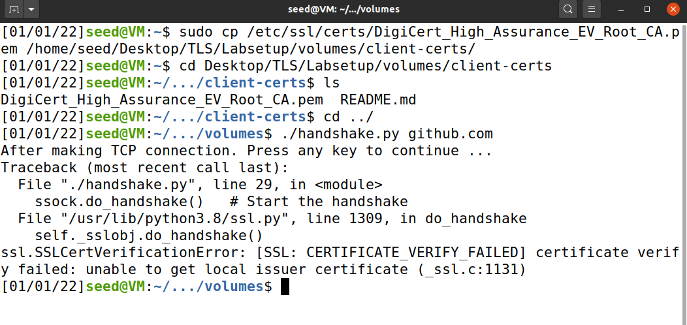
while running unchanged ```handshake.py``` to monitor which crt is being accessed.
And we need to make a symbolic with the hash value of its common name field:
```
openssl x509 -in client-certs/DigiCert_High_Assurance_EV_Root_CA.pem -noout -subject_hash
# 244b5494
ln -s client-certs/DigiCert_High_Assurance_EV_Root_CA.crt client-certs/244b5494.0
```
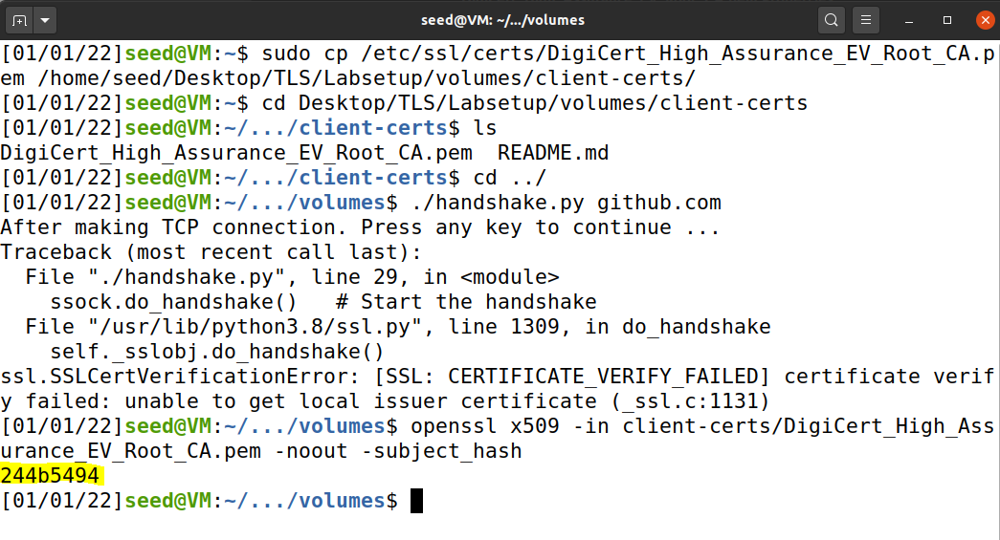
See the result change using
```
ls -ld
```

### Task 1.c
- Step 1: get the IP address of ```github.com```
```
dig github.com
; <<>> DiG 9.16.1-Ubuntu <<>> github.com
;; global options: +cmd
;; Got answer:
;; ->>HEADER<<- opcode: QUERY, status: NOERROR, id: 35887
;; flags: qr rd ra; QUERY: 1, ANSWER: 1, AUTHORITY: 0, ADDITIONAL: 1

;; OPT PSEUDOSECTION:
; EDNS: version: 0, flags:; udp: 65494
;; QUESTION SECTION:
;github.com.			IN	A

;; ANSWER SECTION:
github.com.		13	IN	A	13.234.176.102

;; Query time: 11 msec
;; SERVER: 127.0.0.53#53(127.0.0.53)
;; WHEN: Sat Jan 01 04:29:58 EST 2022
;; MSG SIZE  rcvd: 55
```
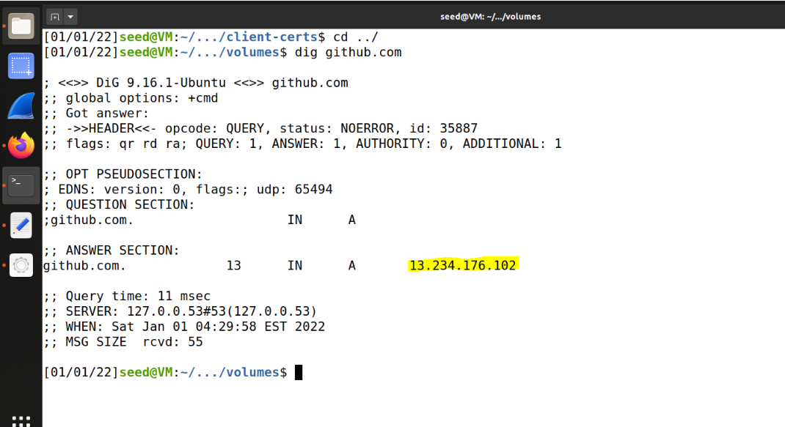
- Step 2: In the client container, edit /etc/hosts to add 2 lines:
```
13.234.176.102 www.github2021.com
13.234.176.102 www.github2021.com
```
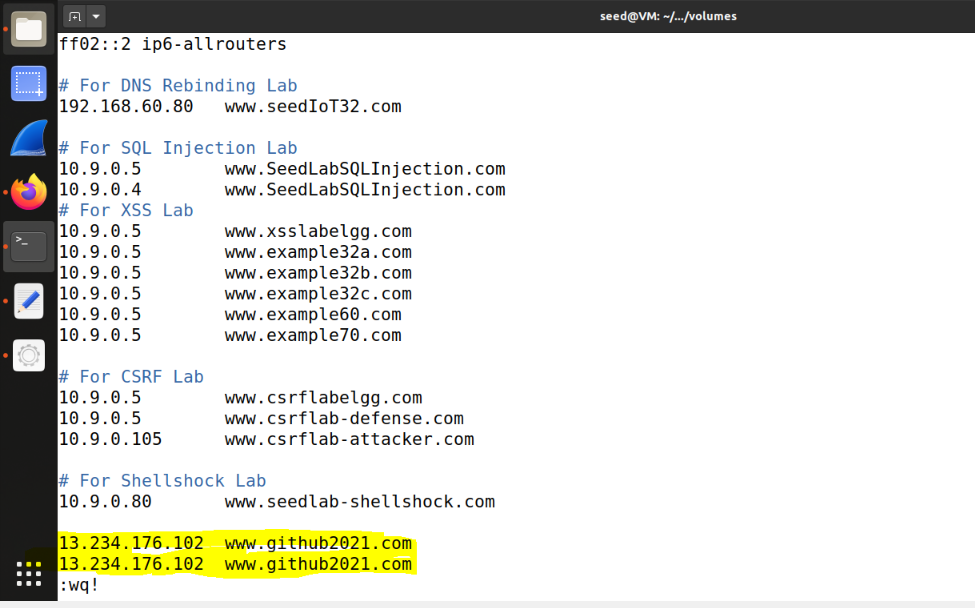
- Step 3: Change ```context.check_hostname``` as ```False``` in ```handshake.py```
It works like what it did in Task 1.c, but if context.check_hostname is set back as True, an error appears when verifying certificate:
```
Traceback (most recent call last):
  File "./handshake.py", line 29, in <module>
    ssock.do_handshake()   # Start the handshake
  File "/usr/lib/python3.8/ssl.py", line 1309, in do_handshake
    self._sslobj.do_handshake()
ssl.SSLCertVerificationError: [SSL: CERTIFICATE_VERIFY_FAILED] certificate verify failed: Hostname mismatch, certificate is not valid for 'github2021.com'. (_ssl.c:1123)
```
Because the hostname we request to establish the connection is not the same one specified by the server's SSL certificate.
### Task 1.d
Add HTTP request based on ```handshake.py``` and then get ```http_header.py``` 
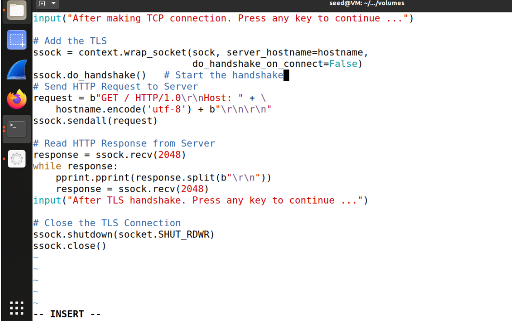
run:
```
./http_header.py github.com
```
As Result
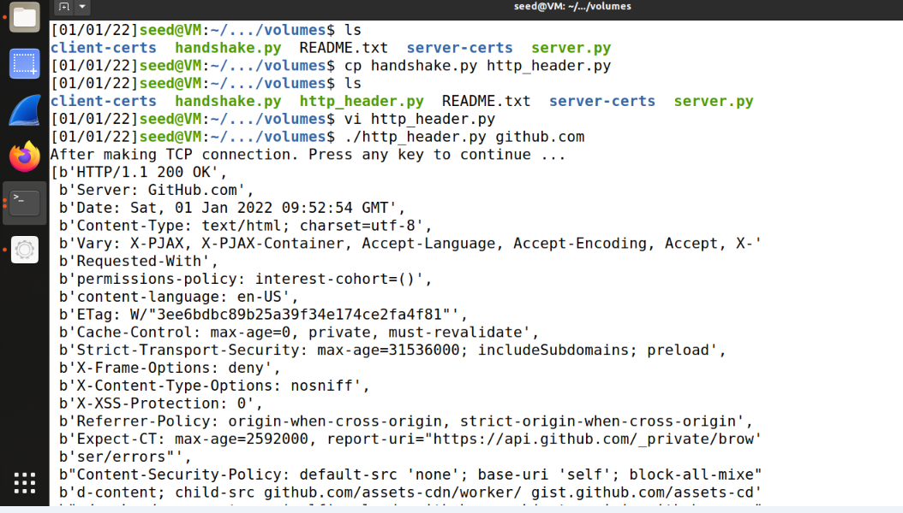
To request for a certain image, specify its relative path as the second argument when running this script. For example:
```
./http-client.py seedsecuritylabs.org assets/images/seed_labs_b.png
```
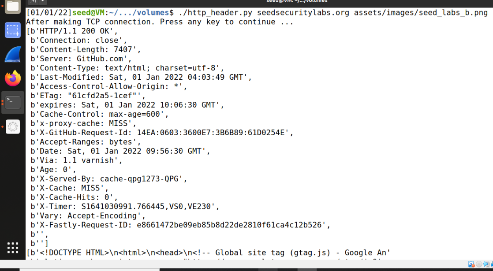
